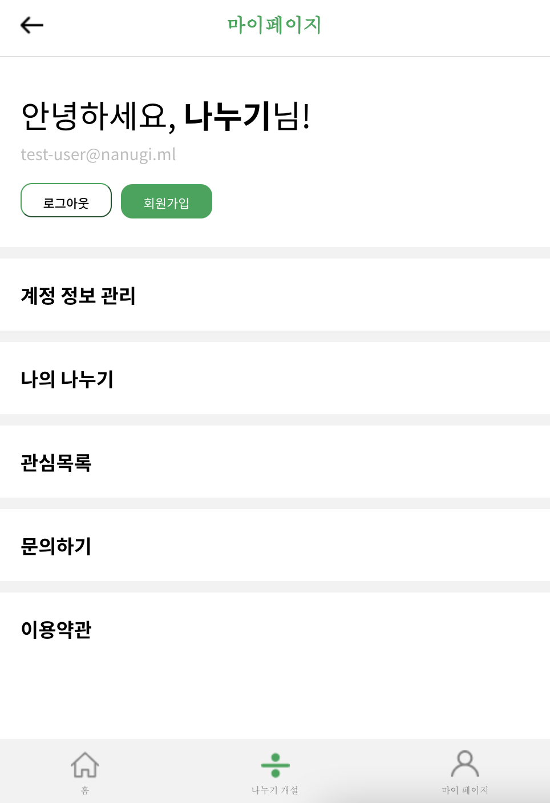

# nanugi-server
- [API Document](https://api.nanugi-eco.com/swagger-ui.html)
- [배포 예시(프론트엔드/디자인 팀과 협업)](https://nanugi.github.io/nanugi-web/)

## 나누기 팀 소개
```
나누기는 사회적 문제를 해결하며 수익도 창출하고자 대학생 6명이 모여 시작되었습니다.
문제 해결은 우리 주변에서 비롯되어야 하며, 우리가 깊이 공감하고 해결하고자 할 때 변화는 시작된다는 믿음을 지니고 있습니다.
이에 대학생을 위한, 대학생에 의한 공유 소비 플랫폼 <나누기>를 탄생 시키고자 합니다.
```

## 어떤 문제를 해결하고자 하는가?
```
1인 가구 대학생은 마트에 가서 과일 하나, 휴지 하나를 사더라도 원하는 양만큼 구매하기 어렵습니다.
대량 구매를 하거나 비교적 비싼 가격으로 소량을 사게 됩니다. 이는 재화 낭비로 이어지거나 과소비로 이어집니다.
이러한 대학생들을 위해, 대학생을 타겟팅한 해결책으로 나누기를 기획했습니다. 

나누기는 대학가를 중심으로 근거리 기반 직거래 방식을 추구합니다.
새 제품을 공동 구매하고, 중고 제품을 거래하며, 타대 학생들과의 활발한 커뮤니티를 구축하려 합니다.
원하는 양을 나눠서 구매함으로써, 대학생 수요에 맞는 중고품을 거래함으로써, 타대 학생들과 광범위하게 소통함으로써 새로운 소비 문화를 구축하려 합니다. 
```
## 사용 프레임워크 및 구현 방식
- AWS RDS, EC2, S3 : 서버 구축
- Spring Boot : REST API 구현

## 사진





## 기능 구현
- [x] 데이터베이스 구현 (유저, 포스트, 관심글)
- [x] JWT를 사용한 로그인/회원가입
- [x] 학교 메일 인증 및 비밀번호 찾기
- [x] 글쓰기, 수정하기, 삭제하기
- [x] 이미지 업로드하기 (aws s3와 연동)
- [x] 메일 보내기, 이미지 업로드 등은 비동기 방식으로 구현
- [x] 나눔글 좋아요 누르기 (토글 형식으로 구현)
- [x] 관심글 목록, 내가 쓴 글 목록 확인하기
- [x] 게시물 검색기능 추가
- [ ] 캐시 처리
- [ ] 무중단 배포
- [ ] 테스트 주도 개발 방식 도입
